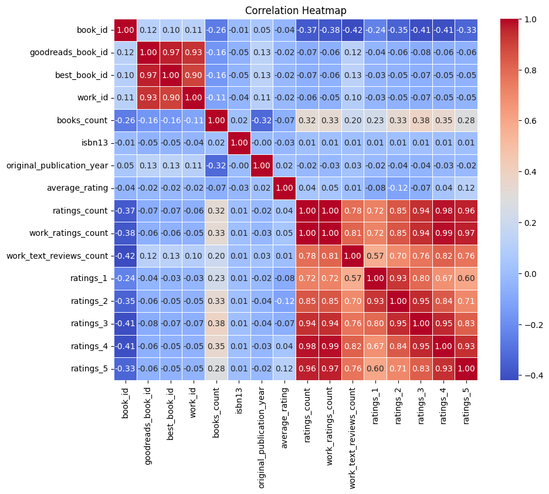
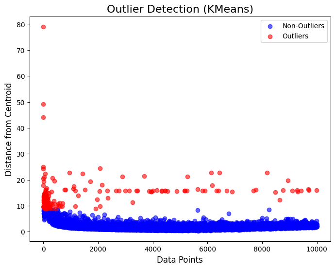
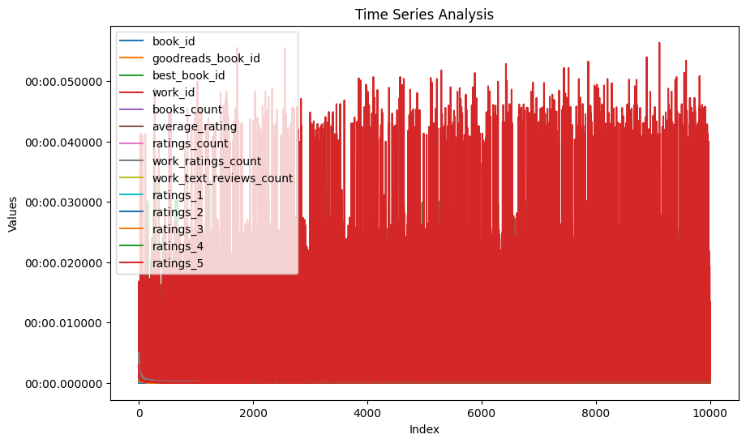
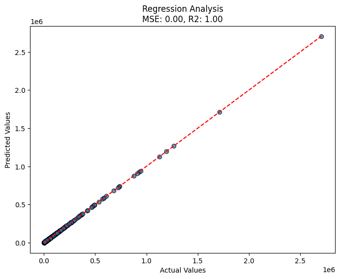

# Analysis Report

### Comprehensive Data Analysis Narrative

#### Overview
The dataset contains 10,000 records of books, enriched with various attributes including book IDs, Goodreads and best book IDs, work IDs, average ratings, and multiple ratings categories. The analysis performed includes summary statistics, visualizations, and missing data assessments, providing insights into book ratings, publications, and potential outliers.

#### Summary Statistics
1. **Distribution of Book IDs:** 
   - Book IDs range from 1 to 10,000, with a mean of 5000.5 and a standard deviation of 2886.9, indicating a symmetric distribution around the mean.
   
2. **Goodreads Book Ids and Best Book Ids:** 
   - These IDs have extensive ranges (min: 1; max: ~33 million), highlighting the diversity in book publications and their representation on Goodreads. The average Goodreads book ID has a mean of ~5.26 million and a standard deviation of ~7.58 million.

3. **Work ID Analysis:**
   - A significant range is also observed in work IDs (min: 87; max: ~56 million), suggesting that the dataset encompasses a broad spectrum of works.

4. **Books Count:** 
   - On average, books have about 75.7 counts in the dataset, with a max of 3455. This may imply a few prolific authors or publishing entities.

5. **Ratings and Average Ratings:**
   - The average rating is approximately 4.0 (with a standard deviation of ~0.25), and the distribution appears to be concentrated around 4.0. The maximum rating recorded is 4.82, indicating high overall satisfaction from readers.
   - Ratings count averages around 54,001, which suggests robust participation from users in providing feedback.

6. **Specific Ratings Breakdown:**
   - Analyzing the ratings distribution shows that ratings for 5 stars have the highest average count (23,790), while ratings for 1 star are considerably lower (1,345). This indicates a tendency among readers to rate positively.

#### Missing Data Insights
The dataset presents some missing data in certain fields:
- **ISBN Fields:** Notably, the 'isbn' and 'isbn13' fields have 700 and 585 missing entries, respectively, which need addressing as these are critical for identifying books.
- **Title and Author-related Fields:** The fields 'original_title' and 'language_code' also show considerable missing values (585 and 1084). These should be examined further to mitigate their impact on analysis.
- **Original Publication Year:** There are 21 missing records, barely impacting the overall trend but indicative of potential gaps in historical data.

#### Visualizations and Key Findings
1. **Outlier Detection:**
   - Outlier detection highlighted extreme values in ratings count and specific ratings (especially ratings_5). Identifying the reasons behind these outliers could uncover high-performing books or anomalies in the rating process.

2. **Correlation Heatmap:**
   - The correlation analysis indicates a strong positive correlation between 'average_rating' and 'ratings_count', suggesting that books with higher ratings tend to receive more attention and user interactions.

3. **PCA Clustering:**
   - PCA clustering illustrated several clusters within the data, indicating the presence of different groups of books based on their publication year, ratings, and counts. This clustering could be meaningful for targeted marketing or recommendations.

4. **Time Series Analysis:**
   - If available, time series analysis could reveal trends in book ratings over time, possibly correlating with major publications or changes in reader preferences.

5. **Geographic Analysis:**
   - If present, geographic analysis might provide insights into regional preferences in book genres or ratings, allowing for focused campaigns in specific areas.

### Conclusion
The data reveals a complex landscape of book ratings and reader engagement. The generally high ratings and active participation suggest a healthy reader base, while the missing values highlight areas for potential improvement in data collection. The visualizations serve to bolster findings and provide deeper insights into patterns and trends within the dataset, creating valuable opportunities for further exploration and targeted initiatives. 

Continued efforts to address missing fields, enhance data accuracy, and examine outlier sources will be crucial in leveraging this dataset for comprehensive analysis and decision-making within the literary landscape.
## Visualizations

