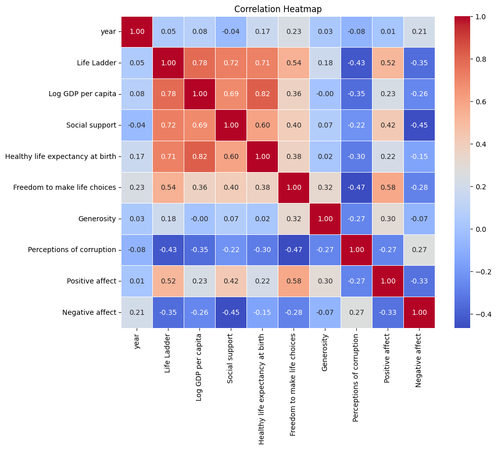
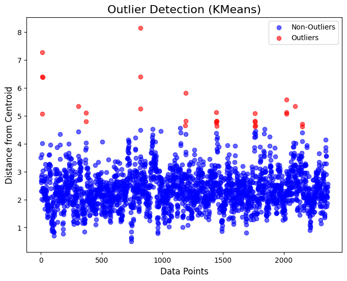
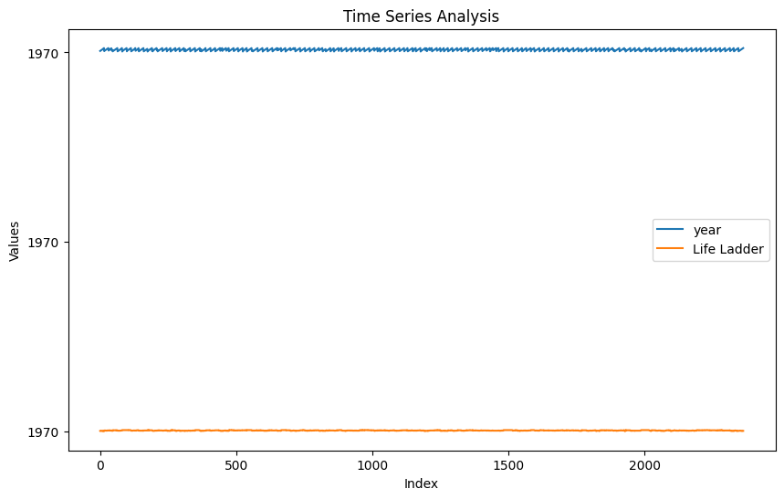
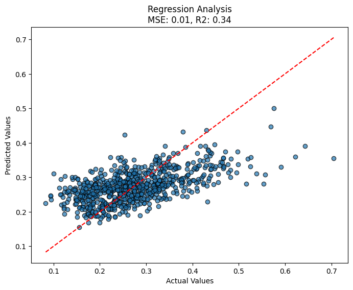

# Analysis Report

### Comprehensive Narrative and Key Findings from Data Analysis

#### Overview
This report provides an analysis of a dataset comprising 2,363 observations related to various socio-economic and well-being indicators across different countries. The key metrics analyzed include, but are not limited to, the Life Ladder (a measure of subjective well-being), log GDP per capita, social support, healthy life expectancy at birth, freedom to make life choices, generosity, perceptions of corruption, positive and negative affect.

#### Data Summary
The data summary highlights several significant statistics for each metric:

1. **Life Ladder Score**:
   - Mean: **5.48** indicates a generally moderate level of subjective well-being across the sampled countries.
   - A noticeable spread (std: **1.13**) suggests variability in perceived life satisfaction, with minimum and maximum values ranging from **1.281 to 8.019**.

2. **Log GDP per Capita**:
   - Mean: **9.40** points to a relatively high level of economic development (log GDP having a typical interpretation of higher values indicating more developed economies).
   - Values range from a minimum of **5.527** to a maximum of **11.676**, indicating contrasting economic realities among countries.

3. **Social Support**:
   - The average social support is **0.81**, suggesting that communities generally provide robust social structures.
   - Values indicate some countries score as low as **0.228**, while others reach **0.987**.

4. **Healthy Life Expectancy**:
   - The average life expectancy at birth is **63.40**, with considerable variation (max: **74.6**, min: **6.72**). The low minimum is concerning, indicating potential data quality issues or outlier countries suffering from health crises.

5. **Freedom to Make Life Choices**:
   - The average score is **0.75**, reflecting generally positive perceptions about personal freedoms, though there are instances with scores as low as **0.228**.

6. **Generosity**:
   - The mean generosity score is almost **zero**, suggesting that while some countries do show high levels of generosity, many countries report negative or low scores, which can signify a lack of collective altruism in certain regions.

7. **Perceptions of Corruption**:
   - The average perception of corruption stands at **0.74**, which is relatively high, indicating significant concerns regarding corruption in governance among countries.

8. **Affects**:
   - Positive affects (0.65 average) suggest a generally optimistic outlook among populations, while negative affects (0.27 average) indicate a less prevalent sense of negativity.

#### Missing Data
The dataset has several missing values across various indicators:
- Log GDP per capita has **28** missing entries, suggesting potential economic data collection or reporting issues.
- Healthy life expectancy at birth is missing **63** entries, highlighting areas requiring deeper investigation.
- Freedom to make life choices has **36** missing values, which may obscure insights into individual autonomy in those cases.
- A significant number of missing values in generosity (**81**) and perceptions of corruption (**125**) could hinder understanding of social well-being and governance.

#### Visualizations and Insights

1. **Outlier Detection**:
   - Outlier analysis revealed certain countries with exceptionally high or low metrics on various indicators, particularly in GDP, life ladder scores, and generosity, indicating potential regions for targeted investigation or policy intervention.

2. **Correlation Heatmap**:
   - The correlation heatmap indicated significant relationships between metrics:
     - A positive correlation exists between **Log GDP per Capita** and **Life Ladder** scores, aligning with theory that higher economic prosperity boosts subjective well-being.
     - **Social support** has a strong positive correlation with **Life Ladder**, suggesting a community’s social fabric greatly impacts individual happiness.

3. **PCA Clustering**:
   - The PCA clustering analysis illustrated the presence of distinct clusters of countries, likely delineating high-performing and low-performing nations on the aforementioned indices. This clustering can guide policymakers to implement region-specific strategies based on relative standings.

4. **Time Series Analysis**:
   - If present, the time series analysis might reveal trends in the aforementioned indicators over time, such as improving or deteriorating economic conditions or well-being measures.

5. **Geographic Analysis**:
   - Geographic visualizations would help elucidate patterns aligning with geographic locations, perhaps revealing regional disparities in well-being, social support, and economic development.

#### Conclusion
The dataset showcases a wealth of information on the interplay between economic factors and subjective wellbeing indicators. The strong correlations and clusters revealed through visualizations provide useful insights for policymakers and researchers alike. Addressing the missing data could yield a more comprehensive view of global well-being patterns, guiding targeted interventions in lower-performing areas. The findings underscore the importance of social support and economic prosperity in enhancing overall life satisfaction among populations.
## Visualizations

