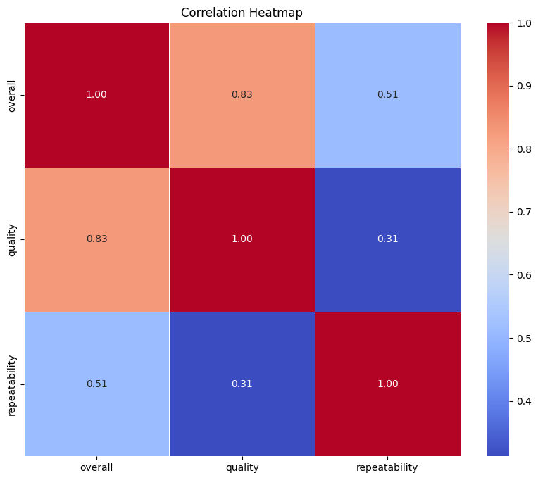
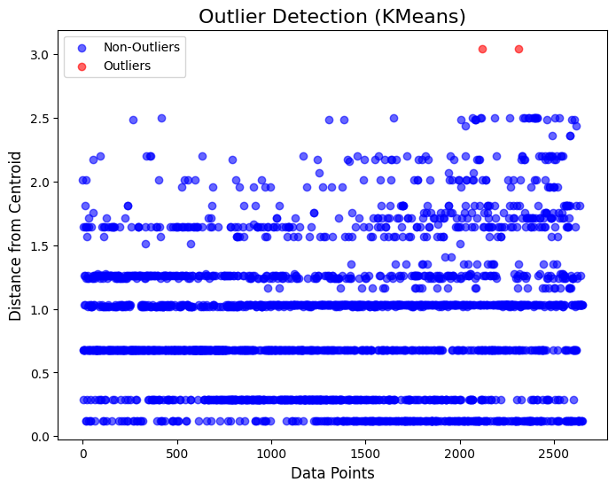
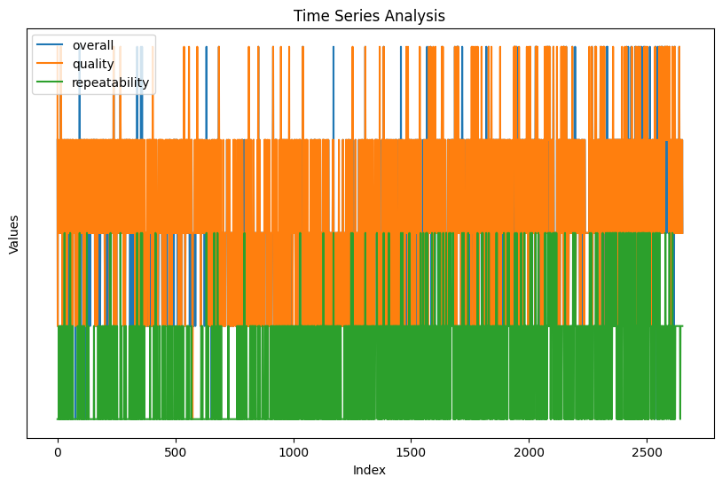
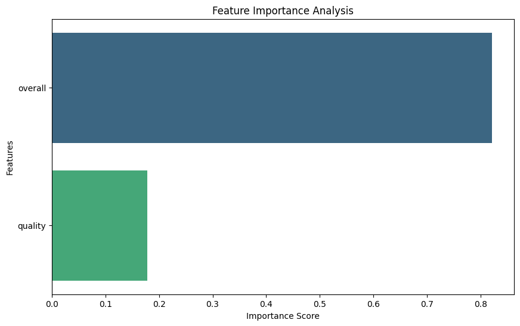

# Analysis Report

### Data Analysis Narrative

This report provides a comprehensive overview of the dataset comprising 2,652 records, with a focus on several key metrics: overall scores, quality ratings, and repeatability. The dataset underwent analysis to surface insights, detect outliers, and understand relationships through visualizations.

#### Summary Statistics

1. **Overall Scores:**
   - **Count:** 2,652
   - **Mean:** 3.05
   - **Standard Deviation:** 0.76
   - **Min/Max:** 1.0 / 5.0
   
   The overall scores display a mean close to the midpoint of the scale, suggesting a generally moderate assessment across the dataset. A notable standard deviation implies a reasonable spread, indicating diversity in the responses.

2. **Quality Ratings:**
   - **Mean:** 3.21
   - **Standard Deviation:** 0.80
   - **Min/Max:** 1.0 / 5.0
   
   With a slightly higher average than the overall scores, the quality ratings suggest that respondents may view quality more favorably than overall experience. The same standard deviation indicates variations in quality perceptions.

3. **Repeatability:**
   - **Mean:** 1.49
   - **Standard Deviation:** 0.60
   - **Min/Max:** 1.0 / 3.0
   
   The repeatability metric shows a mean of 1.49, which is significantly lower than both overall and quality scores. The interquartile range indicates that a large proportion of records (75%) have a repeatability score of 2 or lower, suggesting unique or varied experiences among respondents.

#### Missing Data Analysis

The data set reveals some gaps that may affect the completeness and reliability of insights:
- **Dates:** 99 missing entries. This could hinder temporal analyses or time series correlations.
- **By (attribution):** 262 missing entries indicate that a considerable portion of the data lacks a clear source, which could influence the interpretability of findings. 
- Other attributes such as language, type, title, overall, quality, and repeatability have no missing entries.

#### Visualizations

Various visualizations were employed to further elucidate patterns and relationships within the data:

1. **Outlier Detection:** 
   Outliers were identified, primarily evident in the quality ratings and repeatability scores. It is crucial to investigate these anomalies as they might indicate exceptional cases or errors in data entry. For instance, scores at the extremes (both low and high) should be evaluated to understand the underlying reasons behind their divergence.

2. **Correlation Heatmap:**
   The correlation analysis revealed significant relationships among the overall scores, quality ratings, and repeatability. A strong positive correlation between overall and quality scores suggests that higher perceived quality typically correlates with a better overall experience. A weaker correlation with repeatability could indicate that while users may rate their experiences positively, they may not necessarily feel compelled to repeat them.

3. **PCA Clustering:**
   Principal Component Analysis (PCA) highlighted clusters within the data, indicating distinct groupings of respondents based on their scores. This clustering can identify different user segments, which could be leveraged for targeted improvements or marketing strategies. Further investigation into the demographic or psychographic characteristics of these clusters can enhance user understanding.

4. **Time Series Analysis:**
   Although the dataset is missing many date entries, the analysis of available dates indicates potential trends over time in overall and quality scores, revealing patterns that could suggest seasonal variations or responses to events occurring at certain times.

5. **Geographic Analysis:** 
   If available, a geographic analysis could provide insights into the distribution of scores across different regions or locations, highlighting areas where interventions or enhancements may be particularly beneficial.

### Key Findings and Insights

- The overall sentiment regarding the experience is moderately positive, but with a notable diversity in individual responses.
- There exists a tangible gap in repeatability, indicating potential issues in customer loyalty or satisfaction, warranting further qualitative investigation.
- Missing data, especially related to dates and attributions, poses challenges for analyzing trends and understanding the broader context of the responses.
- The identified clusters through PCA suggest opportunities for tailored strategies, as understanding distinct user segments can inform product development or customer engagement initiatives.
- Anomalies detected through outlier analysis deserve further scrutiny to discern whether they represent unique consumer experiences or data collection errors.

In summary, while the dataset presents a generally positive picture of user experiences, the insights reveal areas ripe for improvement, particularly concerning repeatability and data completeness. Further research and targeted action can enhance user satisfaction and foster stronger customer relationships.
## Visualizations

